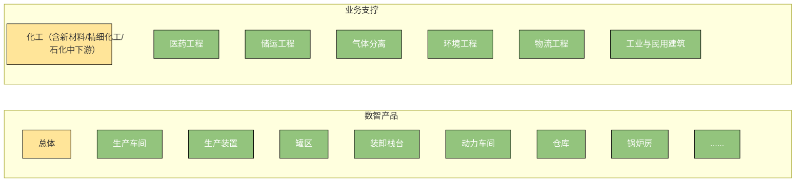

```mermaid
flowchart LR

%% 一级分类（黄色背景）

subgraph 数智产品["数智产品"]
direction TB
style 数智产品 width:1500px
B1[总体]:::yellow
B2[生产车间]:::green
B3[生产装置]:::green
B4[罐区]:::green
B5[装卸栈台]:::green
B6[动力车间]:::green
B7[仓库]:::green
B8[锅炉房]:::green
B9[......]:::green
end

subgraph 业务支撑["业务支撑"]
direction TB
style 业务支撑 width:1500px
A1[化工（含新材料/精细化工/石化中下游）]:::yellow
style A1 width:200px
A2[医药工程]:::green
A3[储运工程]:::green
A4[气体分离]:::green
A5[环境工程]:::green
A6[物流工程]:::green
A7[工业与民用建筑]:::green
end

%% 配色定义
classDef yellow fill:#FFE599,stroke:#000,stroke-width:1px
classDef green fill:#93C47D,stroke:#000,stroke-width:1px,color:#fff
classDef purple fill:#D9D2E9,stroke:#000,stroke-width:1px
classDef hidden fill:none,stroke:none
```